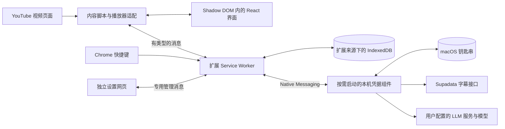

# YouTube 学习笔记插件技术方案

> 状态：实现前方案，代码尚未编写，接口及真实 YouTube 页面尚未实测。技术选择为当前实施默认，验证失败须记录调整原因。
> 配套文档：[计划](PLAN.md)、[界面设计](design.md)、[文件架构](architecture.md)、[LLM 与服务设置](service-settings.md)、[测试方案](test-plan.md)、[测试反馈](test-feedback.md)。

## 一、整体架构与选择理由

第一版采用 Chrome Manifest V3 扩展，在 YouTube 页面内插入入口、阅读面板与快捷笔记窗。用户已确认 API key 交给 macOS 系统钥匙串保存。本机凭据组件按需启动，只管理凭据、服务连接资料和受限的带凭据请求；扩展负责分段、翻译批次、AI 流水线、任务恢复与笔记。关闭浏览器后不要求本地继续处理。

直观地说：页面负责看和记，扩展后台负责保存和调度，本机组件按需从钥匙串取用凭据向外部服务请求结果，响应不回传密钥。面板是否打开只影响显示，不决定快捷键和保存能力是否存在。

| 层次 | 拟采用技术 | 责任与取舍 |
| --- | --- | --- |
| 扩展打包 | Manifest V3、TypeScript、Vite | 输出本地加载的完整扩展包；开发时锁定依赖版本，不从远程加载可执行代码 |
| 页面界面 | React、CSS 变量、Shadow DOM | 状态视图和样式隔离；尺寸、字体与颜色以 design.md 为准 |
| 播放器适配 | 内容脚本、HTMLVideoElement 事件 | 读取时间、跳转播放、检查页面和播放器是否属于当前视频 |
| 调度 | 扩展 Service Worker、类型化消息 | 接收快捷键、管理视频上下文、访问扩展数据和本机组件 |
| 持久化 | IndexedDB，位于扩展来源 | 保存逐字稿修订、笔记快照、草稿、任务描述；小型显示偏好使用 chrome.storage.local |
| 本机凭据组件 | Native Messaging、Node.js/TypeScript、macOS Keychain 桥接 | Chrome 按需启动；无 HTTP 监听端口；原生桥接、运行时打包和签名在技术验证后锁定 |
| 验证 | Vitest、Playwright、真实 Chrome 人工操作 | 纯逻辑、可控接口夹具、浏览器流程和真实服务各自提供证据 |

用户确认的是系统钥匙串保存与一次安装本机组件；Native Messaging 为当前实施选择。首次配置并授权后，目标是浏览器重启或换视频无需再次填写 API key，也不设置插件自己的日常解锁密码。钥匙串锁定、授权变化或组件更新可能引起系统确认，须实测，不能承诺永不弹窗。Node.js 是开发技术选择，交付须打包所需运行时，不要求用户手动启动服务。

Chrome 可按消息或连接启动本机程序；组件不注册开机常驻服务、不监听回环端口。通信使用标准输入输出，仅允许登记的扩展 ID。[Native Messaging 文档](https://developer.chrome.com/docs/extensions/develop/concepts/native-messaging)

## 二、页面范围与权限

### 页面范围

- 页面内入口、面板、快捷笔记仅在 YouTube 视频上下文中显示，其他网站不注入界面。
- 用户已确认第一版支持普通 `https://www.youtube.com/watch?v=...` 点播视频页；Shorts、正在直播及站外嵌入播放器留待后续，不挂入口、不响应记笔记命令、不请求字幕或 AI。正在直播也可能使用 watch URL，不能仅依据路径认定支持；需结合实际播放器状态识别，状态不明时等待而非误采直播时间。
- 内容脚本可以匹配 `https://www.youtube.com/*`，用于检测从首页以站内导航进入视频。非视频页仅保留轻量上下文探测，不挂载可见组件、不读取无关页面内容、不请求字幕。
- 以 URL 解析器和视频标识规则判断页面，不以任意字符串含有 youtube 作为依据；`youtu.be` 经正常跳转后在最终视频页工作。
- 非视频页快捷键不创建笔记、不请求接口。扩展被浏览器禁用时不能响应快捷键；“未打开”在本需求中指面板关闭。
- Chrome 工具栏固定的扩展图标属于浏览器界面；“不显示”约束网页内界面，不能承诺控制浏览器自身的图标可见性。
- 用户主动打开的独立设置网页为扩展自己的 options.html，不属于向其他网站注入界面；不依赖当前是否有 YouTube 视频。

### 最小权限设计

| 声明 | 用途 |
| --- | --- |
| content_scripts.matches = https://www.youtube.com/*，all_frames = false | 顶层 YouTube 页面探测和挂载 |
| host_permissions 中的 https://www.youtube.com/* | 在当前 YouTube 标签页识别 URL 和发送针对性消息 |
| nativeMessaging | 扩展后台与登记的本机组件通信；本机清单 allowed_origins 只允许目标扩展 ID |
| storage | 小型偏好与会话相关设置 |
| webNavigation | 监听顶层站内地址变化以及导航完成 |
| commands 清单项 | 注册快捷记笔记命令，不需要为其另加名为 commands 的权限 |

默认不申请所有网站、浏览历史、cookies、剪贴板读取或下载全站数据权限。导出优先在当前页面通过 Blob 触发用户下载，若验证确需 downloads 权限再补充理由。声明式内容脚本已足够时不申请 scripting。不以 tabs 广泛读取所有标签页内容作为默认方案。

Chrome 官方支持在后台接收扩展命令，并允许用户重设快捷键；快捷键冲突可能导致未绑定，需要检查实际注册结果。[快捷键文档](https://developer.chrome.com/docs/extensions/reference/api/commands)

## 三、视频上下文与切换隔离

### 标识与状态

- 每个顶层标签页维护 `tabId + documentId + videoId + navigationEpoch`。
- `videoId` 用于数据归属；`navigationEpoch` 在每次视频上下文切换时递增，用于阻止旧异步结果写入当前界面。
- 同一视频更换播放列表参数、时间参数不重新获取整份字幕；时间跳转只更新播放位置。
- 每个视频独立保存逐字稿、AI 结果、笔记、草稿和阅读位置。语言与面板宽度属于用户偏好。

### 检测方式

使用顶层 `webNavigation.onHistoryStateUpdated`、导航完成事件，配合页面 `popstate`、`pageshow` 和有限范围 MutationObserver 检测播放器重建。YouTube 的自定义事件和 DOM 选择器仅作为待实测适配点，不能视为稳定公开接口。所有触发汇入同一个幂等 `reconcileVideoContext()`，禁止每触发一次就再挂一套监听器。[导航事件文档](https://developer.chrome.com/docs/extensions/reference/api/webNavigation)

### 从 A 切换到 B 的顺序

1. 收到新视频上下文，先使旧请求的界面订阅失效，清除 A 的高亮、可见字幕和 AI 内容。
2. A 的已有草稿保持绑定 A 及创建时间；持久草稿不因卸载组件丢失。
3. 卸载旧播放器事件，递增上下文代次；等待 B 的 URL 与有效播放器状态匹配。
4. 若面板原本打开，保留打开偏好，展示 B 的缓存或加载状态。面板原本关闭则只保留小入口，不自动发起全视频处理。
5. 所有请求携带视频、版本及操作标识，返回后校验；A 的迟到结果最多进入 A 的缓存，不能出现在 B 的界面。
6. 返回 A 时恢复 A 自己的数据；离开支持的视频页或进入 Shorts、正在直播等范围外上下文时拆除页面 UI 并停止播放监听，保留已有草稿。

AbortController 只能取消本地等待，不能保证供应商任务已经取消或不会计费。任务编号应持久化，回来后查询原任务，不直接重复提交。

多标签页分别维护视图上下文。同一视频共享持久数据时用修订号做并发检查，避免后写覆盖另一标签页的较新编辑。

## 四、字幕与翻译处理

### Supadata 接入边界

- 后端适配 `/transcript`，使用带时间片段的返回形式，不用只有纯文本的返回值承载播放同步。
- 先以 `native` 获取已有字幕；不能用会自动生成的 `auto` 绕过确认。没有字幕时先展示估算并确认，再提交 `generate`。每个新生成请求都需确认，已有 jobId 查询和已缓存结果复用不重复询问。
- 异步生成记录 `jobId`，使用退避查询；429、鉴权错误、不可用内容、空结果和网络错误分别映射到用户可理解的状态。
- 请求语言不可用会回退，必须验证实际返回语言，不能把其他语言标为英文或中文。
- 本地片段编号、毫秒单位、开始结束时间在适配层统一校验；缺少有效时间信息的文本不能冒充已支持精准同步。

接口规则依据 [Supadata 逐字稿说明](https://docs.supadata.ai/get-transcript) 和 [参数文档](https://docs.supadata.ai/api-reference/endpoint/transcript/transcript)，均须通过真实样本复核。费用参考 [官方价格页](https://supadata.ai/pricing)，不在界面写死会变化的免费额度承诺。

### 本地阅读分段算法

2026-09-12 已确认基础方向，0.1.8 已补充巨段修复，分段算法版本为 2；真实 Chrome 视频效果尚待验收，需求范围见 [实施计划](PLAN.md)。

1. 所有字幕来源进入统一的本地重组流程；保存原始时间片段及来源索引。仅在有充分证据时处理滚动字幕重复，保留真实口语重复。
2. 建立带来源映射的连续文本，允许跨条目合并和条目内断句。先识别可靠句子边界，再组合阅读段落，之后执行翻译。
3. 处理缩写、小数、姓名、引号等边界例外；可靠说话人变化阻止跨人合并，缺少标记时不推测说话人。源字幕时间间隔仅作辅助信号，不等于真实语音停顿。
4. 向后比较完整句的多种组合，优先保证边界可靠，再减少残余短段并接近长度目标。采用动态规划，每个起点最多比较后续 32 个句子或分句单元；以长度偏差平方评分，超过软目标的偏差权重为 4，每段基础代价为 0.18，跨越完整句末且字幕间隔至少 1400ms 的边界增加代价 3。不强求段落等长，参数为待真实样本调优的实施值。
5. 英文原文字符软目标为 220，中文字符占多数时采用 100；完整长句可以超出，真实短回应可以独立。字符数、时长不能单独触发句中硬切。超过两倍软目标的单元搜索英文分句候选，包含转折加主谓、第一人称新分句及少量话题起始结构；排除悬空介词、连接词、引述动词、从句引导词及缩略主谓等。分句末增加 0.35 代价，优先可靠句末；候选不足时保持原文并提示。
6. 阅读边界可与原始时间片段边界不同；只有片段级时间时保留来源精度，不虚构句内单词的精确起点。短引用只在 240 字符内保护内部句末；长引用不屏蔽内部完整句。`>>` 仅在会话上下文得到支持时阻止跨轮次组合，不推断人物身份。新增可选 `segmentationWarning` 表示推断分句或尚存长段，当前两倍软目标为偏长提示线。新增可选 `sourceSpans` 保存条目编号、字符起止、原始子串和来源时间，`segmentationVersion` 标记算法版本；老记录字段缺省仍可读取。
7. 每段保留稳定标识和来源映射，原文与译文使用同一段标识。重新分段需建立新旧映射并保护手改内容、译文及笔记来源快照，不直接覆盖已有缓存。

代码位于 extension/src/segmentation/，不引入外部断句依赖；SaT 按用户要求延后，音频处理和逐段人工合并／拆分入口不在本轮。旧缓存通过预览应用，`transcriptBackup` 保存上次逐字稿和译文，恢复时交换当前及备份。手改段落保持原样；未变边界复用标识及译文，改变边界清空新段译文，原译文保留在备份。笔记内容不自动改写，新段的 `sourceCueIds` 可映射到旧缓存段编号；升级旧分段优先校验并恢复 `sourceSpans`，合并相邻同源连续范围；内容不匹配或缺少范围时才以现有段落文本及时间为来源，不能从导出稿虚构词级时间。真实样本验证覆盖破句、过度合并、漏字重字、时间定位、耗时及内存，不以库的公开指标替代产品验收。

### 翻译引擎与运行环境

用户已确认普通翻译优先本地、LLM 翻译主动触发。Chrome Translator API 是待验证实现，不模拟整页翻译菜单，不抓取被整页翻译改写的 DOM 作为译文。

- 在实际 Chrome 与扩展来源文档中验证 API、英语到简体中文语言对、用户激活和下载进度；不假定 Service Worker 可以调用。独立扩展翻译文档作为候选执行环境，生命周期和面板关闭时的快捷摘录必须实测；验证失败记录阻塞，不默默换云端。
- 原文模式不触发全文翻译；中文/双语及缺失的双语摘录优先本地翻译。首次需激活或下载时明确提示，已有草稿先保存。
- 采用受限消息委派本地翻译任务，校验来源、段标识与输入版本；本地翻译无需本机凭据组件或 LLM key。批次排队、取消订阅和恢复由扩展管理。
- LLM 翻译仅在明确点击后调用：默认当前段，全文单独触发并显示范围。候选结果由用户选择应用，事务前检查原文及译文修订，不能覆盖生成期间的新编辑。已有笔记仅提示来源差异。
- 本地失败、模型下载失败或不支持时不自动调用付费服务；只有用户主动选择 LLM 才发送。AI 梳理仍走独立 LLM 任务。

依据 [Chrome Translator API 文档](https://developer.chrome.com/docs/ai/translator-api)，首次下载、用户激活、语言支持与文档运行环境均须实测，当前没有可用性或质量结论。

### 按需翻译与缓存

- 原文模式先显示原文；中文或双语模式创建所需翻译任务。
- 翻译通过所选引擎以可控批次处理原文和段标识，使用相邻上下文辅助理解，返回必须覆盖预期标识，不能改变时间或凭空增删段落。
- 缓存键包括视频、段标识、原文版本、目标语言、翻译引擎、适配器版本及可取得的模型/配置版本；浏览器未公开本地模型版本时不得虚构，记录可取得的 Chrome 版本与生成时间；切换模式复用结果。
- 正在翻译时手改中文，会产生人工修订。自动任务不得覆盖这次修订。
- 原文修改后的默认设计：保留已有译文并标记待核对，由用户触发重译；这是可调整实施默认，不声称用户已确认。
- 进度模型按获取、整理、翻译、完成分阶段。有已完成段数才显示翻译百分比；供应商未知阶段使用不确定进度条。

## 五、播放器联动与输入判定

- 监听 timeupdate、seeking、seeked、play、pause、ratechange、loadedmetadata 和播放器节点替换，基于时间区间二分定位。
- 页面可见且播放时可用节流动画帧补充高亮；停止或隐藏后释放调度，不对整份逐字稿每帧重渲染。
- `following` 与 `browsing` 两种阅读状态独立于播放状态；滚轮、触摸、滚动条和键盘滚动进入 browsing，程序滚动不误判用户输入。
- 点击跟随只滚动逐字稿，不 seek、不改变暂停状态。单击段落则 seek 并请求 play；捕获播放失败并提示，不能显示虚假的播放成功。
- 拖选、存在有效 Selection、编辑器输入、按钮操作、拖动滚动条时不触发段落跳转。
- 同步等待切换后有效播放器就绪；广告期不得拿广告播放秒数作为正片笔记时间。广告识别属于 YouTube 适配风险，需实测；无法确认时提示暂不可定位，不生成伪精确引用。
- 标题和链接同样是外部数据，只作文本渲染。

## 六、面板关闭时的快捷记录

快捷键由后台注册，内容脚本在视频页保持轻量上下文接收能力，不依赖主面板组件。默认只在 Chrome 聚焦、当前活动标签为有效 YouTube 视频时执行，不注册系统全局快捷键。候选为 macOS 的 `Command+Shift+Y`、其他系统的 `Ctrl+Shift+Y`，必须检查实际注册与冲突，界面显示实际键位。用户可以在 Chrome 快捷键设置中修改。

1. 获取当前命令对应标签页，校验有效视频；向内容脚本请求当前播放器上下文。
2. 在接收触发时立即冻结 `videoId`、`capturedAtMs`、标题、来源 URL、上下文代次，先创建持久草稿。
3. 有缓存时查出当时播放段落并放入双语快照；无缓存先打开带时间来源的轻量笔记窗，让用户写想法，同时异步获取和补全引用。
4. 即使视频继续播放或页面切走，补全也只针对冻结时刻及原视频。后台补全不能覆盖用户已手动编辑的引用。
5. 确实取不到字幕时保留用户记录和时间链接，标记“引用待补全／无法获取”，不能伪造摘录；用户可重试。
6. 主面板保持关闭，默认不暂停视频，不自动请求整份 AI 摘要。取得字幕需要全片请求的供应商，仍按实际全片成本说明，不能称只计算一个片段。
7. 重复快捷键以事件标识防止意外重复记录；当前视频笔记窗已有未完成编辑时聚焦原草稿并提示先完成，不创建新条目、不替换引用。切换视频后原草稿已保存收起，新视频可以创建自己的草稿。

当前时间是在命令送到播放器后读取的，存在事件传递延迟；“按下那一刻”是交互目标，需实测量化，不能宣称零延迟。

## 七、持久化与编辑模型

### 主要数据对象

| 对象 | 关键字段与用途 |
| --- | --- |
| VideoRecord | videoId、标题、规范链接、时长、元数据版本 |
| TranscriptRevision | videoId、revisionId、源语言、供应商、原始时间片段、创建时间 |
| SegmentRevision | segmentId、sourceCueIds、startMs、endMs、originalText、translatedText、各自修订号、人工修改标识 |
| Note | noteId、videoId、capturedAtMs、range、sourceSegmentIds、quoteSnapshot、sourceRevision、selectedText、thought、question、noteRevision、createdAt、updatedAt |
| Draft | draftId、冻结来源、当前输入、revision、baseRevision、补全任务、保存状态 |
| Analysis | videoId、sourceRevision、模型配置版本、中文结构化结果、生成时间 |
| Job | requestId、videoId、输入版本、供应商jobId、状态、错误类别、重试时间、幂等键 |

不要在 YouTube 来源的 localStorage 或 IndexedDB 保存私有笔记。内容脚本访问网页存储与扩展来源不是同一边界，数据访问通过后台消息完成。[扩展存储说明](https://developer.chrome.com/docs/extensions/develop/concepts/storage-and-cookies)

### 保存与修订

- 创建草稿立即持久化；输入采用短防抖自动保存，失焦、关闭和路由切换主动刷新写入。显示“保存中／已保存／保存失败”，只有事务确认后显示已保存。
- 草稿和正式笔记分别保存：新摘录“完成”后成为正式笔记；编辑旧笔记的输入先存编辑草稿，“完成”后产生新修订，“取消本次修改”回到编辑前版本。关闭窗口只收起并保留草稿，不等于完成或丢弃。
- 页面突然被进程结束时最后未确认的键入仍可能未落盘；保存失败留在待保存状态，不假报成功。
- 用户可编辑已保存笔记的摘录文本、理解及疑问；编辑引用只改变笔记快照，不反向修改逐字稿，除非未来明确提供该操作。
- 修改来源后设置相关笔记的更新提示，展示快照与当前版本差异；用户明确选择更新引用，才创建新的笔记修订。
- 如果用户已经自行修改笔记摘录，更新来源时同样显示差异，不能覆盖其自定义文字。理解及疑问永远不参与自动替换。
- 同一笔记多窗口修改使用期望修订号校验；冲突时保留双方草稿并提示，不能最后写入无声覆盖。
- 数据迁移使用事务与版本号，失败可回退；清缓存不等于删笔记，第一版不做隐式自动清除用户记录。
- 扩展 IndexedDB 保存批次进度、供应商任务编号及配置版本；组件只保存受限请求的去重记录和非敏感连接资料。个人想法不发送给组件。

划词摘录保存精确选区、所跨完整源段及每段时间；默认展示精确选中文字和对应整段的另一语言，并在需要时以轻量“上下文译文”提示范围差异，不冒充精确词对词翻译。多段选区逐段保存边界；只在插件逐字稿内响应。此默认需样本验收。

扩展 Service Worker 可以被 Chrome 停止，不能只靠全局变量、setInterval 或一直打开 DevTools 维持任务。扩展按批次调度并持久化进度；组件仅执行当前受限请求，不持有整片任务队列。通信端口不能作为永不休眠的保证；扩展重新唤醒后读取进度，查询已提交供应商任务，再继续未完成批次。退出浏览器时不保证在途请求完成，重新打开后显示可恢复状态，由用户继续；供应商已经接收的任务可能仍在远端执行或计费。[生命周期文档](https://developer.chrome.com/docs/extensions/develop/concepts/service-workers/lifecycle)

## 八、AI 梳理与导出

第一版用户已确认仅使用逐字稿及其时间信息。无字幕时通过字幕服务生成文字，再进入相同文本流程；不新增本机 Whisper 部署要求。不采集视频帧、不做 OCR、不调用图片或视频理解接口，原有播放器时间读取和跳转仍保留。

- 总结与框架、问题、场景、金句、方法和切片建议采用校验过的结构化格式。
- 每条引用携带来源段标识及时间范围；限制在视频有效时长内，金句必须校验对应原文。
- 推导场景与讲者原话分别标记；AI 结果注明“基于逐字稿”。遇到“点击这里”等依赖画面的描述时，说明逐字稿未提供细节，不猜按钮、参数或操作步骤。切片建议仅判断文字内容的独立性，不判断画面效果。最新 0.1.10 先输出主题时间与独立性粗判断，具体切片起止规划后续再做；早期方案为建议起止时间与理由，不下载视频、不剪辑、不编码输出视频文件；不为此引入媒体处理依赖或权限。
- 长视频分批提取再合并全局结构，保留引用映射，拒绝无证据的精确时间和虚构金句。
- 编辑原文后已有 AI 结果标记来源有更新，由用户选择重生成；切换语言不参与 AI 缓存失效。
- 当前阶段个人想法和疑问不发送给大模型，未来笔记整理为用户主动操作。
- 逐字稿搜索只搜索本地已经取得的文字，命中定位不改变视频，明确点击段落才播放；AI“加入笔记”创建带来源的引用草稿，不冒充用户想法。
- 默认导出建议：逐字稿 TXT/Markdown，笔记 Markdown；SRT、直接 Obsidian 写入后续处理。
- AI 梳理可以作为用户明确选择的附加导出内容，保留 AI 来源标识，不默认混入个人笔记。
- 导出采用明确的内容快照，保留视频时间链接、用户笔记和双语引用。未完成译文明确标记缺失，不假装完整。
- 所有用户或视频文字按文本处理，导出转义潜在 HTML 和特殊链接，文件名规范化；不包含凭据、调试日志或本机路径。

## 九、消息、服务与安全约束

### 有限消息协议

`GET_CONTEXT`、`LOAD_TRANSCRIPT`、`SEEK_PLAY`、`CAPTURE_NOTE`、`SAVE_NOTE`、`EDIT_SEGMENT`、`COMPARE_SOURCE`、`UPDATE_QUOTE`、`GENERATE_ANALYSIS`、`EXPORT_DATA` 等类型有独立字段校验。

消息包含 `requestId`、`videoId`、`navigationEpoch` 和输入版本。后台校验 sender.id、顶层 frame、受支持 URL、字段长度和允许操作，不提供“任意 URL 代理抓取”消息。

页面数据和字幕都是不可信输入，不能作为代码、HTML 或模型工具指令执行；Shadow DOM 主要隔离样式，不是阻止宿主页面读取 DOM 的安全屏障。不在其中放凭据，日志也不输出笔记全文。

设置页另有读取/保存服务配置、连接测试、模型列表与任务路由管理协议。管理操作严格验证 sender 为本扩展 options.html，不要求视频上下文；视频内容脚本无权限调用管理接口。详细字段与版本规则以 service-settings.md 为准。

### 本机组件

- 使用 Native Messaging 标准输入输出协议，无 HTTP 服务、配对码、CORS 或本地监听端口。安装时登记目标 Chrome 扩展 ID；开发版和正式版分别验证，禁止通配来源。
- 后台先验证真实消息发送者，组件再验证调用来源、协议版本、操作类型、请求大小及配置引用。页面脚本不能直接调用原生组件，不能伪造设置管理操作。
- API key 默认由组件通过 macOS Keychain 原生桥接写入和使用；环境变量仅保留开发/受管来源，不要求日常用户配置。密钥不放命令行参数，不回传读取接口，不进入浏览器持久存储、日志和导出。
- 组件只提供保存凭据、连接管理、能力测试、固定供应商操作与任务查询；不接受任意命令、文件路径、请求头或通用网络代理。
- 向 Supadata、LLM 的带凭据网络请求在组件执行；扩展只传已登记 profileId、冻结配置版本和经过校验的业务负载。目的地、DNS、重定向与本地 LLM 例外按 service-settings.md 校验。
- 每次请求有 requestId 和期限。持久记录提交意图与供应商 jobId；崩溃后无法确认计费请求是否提交时标记未知，先查询，无法查询则提示用户判断，不能盲目重试。
- 缺失组件、版本不兼容、钥匙串锁定或拒绝授权分别报告；已保存笔记和缓存仍可使用。组件不运行是正常空闲状态，不显示故障；下一次请求由 Chrome 启动。
- 系统密码仅在 macOS 系统窗口输入；安装、升级签名和权限策略必须实测。不得为消除弹窗放宽为任意应用可读，也不得退回明文保存。

## 十、文件架构与 LLM 接入

完整文件树、工作区和依赖方向以 [architecture.md](architecture.md) 为唯一目录规范，避免两处目录示例逐渐不一致。当前不创建空源码骨架。

LLM 连接不固定某一家供应商：第一版实现实际验证过的 OpenAI-compatible Chat Completions 适配器，用户在独立设置页配置 Base URL、API key 和 model ID。其他原生协议未实现前不能宣称支持。Supadata 作为独立字幕适配器，两类凭据不混用。

本地翻译不绑定云端 profileId；主动 LLM 翻译与 AI 梳理分别绑定 profileId 和模型，可共用连接。连接测试必须验证指定模型可以实际生成，列出模型不等于生成成功；未配置 LLM 时原文和本地笔记仍可使用，本地翻译可用时照常运行，只有 LLM 翻译和分析给出设置入口。

独立设置页的字段、任务路由、连接测试、系统凭据保存、配置版本和网络地址规则见 [service-settings.md](service-settings.md)。修改配置只影响新任务，旧结果保留，不能触发整库重翻译。

## 十一、验证与交付条件

先验证页面上下文和面板关闭快捷键，再验证字幕与翻译，随后完成笔记修订、AI 与导出。具体用例以 test-plan.md 为准；界面默认数字均为设计目标，不是已验证指标。

所有范围内测试真实执行通过，缺陷完成修复与回归，用户对同一最终构建明确人工验收通过后，才开始 Git 提交和 GitHub 推送。提交前检查暂存区及敏感内容；不得上传真实字幕样本、个人笔记、凭据或测试账户数据。

当前仓库没有提交记录，也没有远程地址。未来执行前确认目标 GitHub 仓库及可见性，不自行创建公开仓库；推送不等同于发布 Chrome 商店。若人工验收后又改动行为或构建，应对改动重新测试并重新确认该构建。

## 十二、无字幕生成的确认边界

- 估算绑定 videoId、视频时长、供应商、计价规则版本与本次操作 ID；展示预计积分及计算依据，区分生成费用与此前字幕获取费用。估算不是账单或真实余额，不虚构人民币换算。
- 时间或计价规则不足时显示无法估算并禁止提交，提供重试和继续记笔记；不得显示零积分冒充免费。计价规则、时长或目标视频变化后重新展示估算并确认。
- 只有明确点击“确认生成”才提交，取消或关闭均不提交；一次确认仅授权当前生成操作，不授权其他视频或整批任务。
- 后台与组件校验确认绑定及请求去重，防双击、多标签或迟到响应造成重复提交。结果未知先查询原任务；无法确认是否计费时不自动重发，新生成须重新说明并确认。
- 面板关闭的快捷摘录同样受约束：先保存冻结时间、原文可用部分及个人输入，再显示轻量确认；取消后标记引用待补齐，不阻塞保存。
- 连接测试若涉及无字幕生成，同样展示估算并确认；普通字幕连接测试优先已有字幕样本，不暗中生成。

## 0.1.10 AI 内容结构

新增可选 formatVersion=2、知识点及引用列表、前置知识来源、主题切片结论与场景来源，兼容旧持久化记录，不清库。金句可选连续片段范围与精确子串，由程序核对原文；不匹配的条目省略并提示。时间仍采用来源字幕段精度，不虚构句内时间。

全片切片判断由各批主题结论在本地初步汇总，不新增全片模型请求；详细切片规划暂缓。知识点跨批按规范化标题合并并保留各处引用，不声称已完成同义概念语义合并。旧结果展示升级提示，新内容需主动重新整理。导出同步携带新增字段。

本轮审查保留解析函数与合并函数的连续步骤：它们各自在单一入口完成引用验证与结构汇总，无外部副作用；界面拆出 AnalysisDetails，避免 ContentViews 继续承担新增细节。后续复杂度增加时再按引用解析职责拆分。

## 0.1.11 校验边界

金句分类是可选展示元数据，未知值不应使已有可核实内容整批失败。analysis-output.ts 从 unknown 接收分类，按共享分析结构的枚举验证；只去首尾空白，通过才进入结果，不通过则省略标签并警告。文本、引用、知识列表和其他核心结构的验证保持严格。错误位置只由预定义字段名和数组序号组成，不记录或回显原始模型回复。

## 0.1.12 学习问答与复制

共享 questionRequestSchema 限制问题、来源和最多四轮历史以及总上下文大小；服务复用 analyzeProfile。笔记新增可选 sourceKind／aiConversation，旧数据不迁移；引用、个人理解、问题、AI 回答分别存储。answer-note 的顺序为校验输入、保存草稿、显式调用、检查当前界面代次、保留答案、保存回答。关闭／切换视频后不应用迟到答案。个人理解不自动发送。

分析三个字段采用字符串或数组兼容读取，输出提示要求数组；旧文本按句末／换行展示。剪贴板增加 clipboardWrite 和 iframe clipboard-write 授权，同步复制失败自动使用现代接口，恢复选区与焦点；不申请剪贴板读取权限。

## 0.2.0 阅读与笔记精简（2026-09-21）

- 用户确认模块标题降为 16px；主题小标题与正文均 15px，小标题 600 字重，正文普通字重。知识清单“需要理解”“视频中的作用”加粗，段落间距 12px。
- 划词 Note 只保存选中文字及定位信息，不自动补齐关联整段双语逐字稿。知识卡移除常驻 note／AI提问，划词操作保留。
- 表单为摘录、我的理解与价值、我的疑问；后两项选填。删除／取消／AI提问／完成同一行，完成紧邻 AI提问且位于右侧。
- 取消保存最新输入后退出，不恢复编辑前快照；新笔记仍为草稿，已完成笔记保持完成状态。只有完成动作结束草稿状态，删除才移除笔记。保存失败不关闭编辑器。
- 五类金句为反直觉洞察、点透本质、方法与原则、关键事实、案例与经验，不强求各类齐全。读取旧数据时将惊人事实映射为关键事实、轶事映射为案例与经验；新方法类须重新整理后提取。
- 旧划词笔记的存储原文保留，显示、导出及提问不再重复附加。已有问答历史保持；继续追问仍附上最近四轮问答，不自动清理旧回答中的引用。
- 无新增权限或依赖。Chrome 最终视觉与全链路仍待用户验收。

## 0.2.1 结构化知识与可编辑摘录

knowledge.understanding／role 接受字符串或非空字符串数组，模型要求输出数组；旧字符串兼容读取并按现有标点规则展示，分批合并展平去重。生成方、共享协议、展示和导出同步。

笔记新增可选 excerptMarkdown、excerptEdited、excerptFontSize。只序列化受限文字结构，不存任意 HTML；来源快照与个人字段不被修改。编辑器序列化标题、段落、列表和加粗，显示采用 React 文本节点；模型请求携带纯文本及手改标志，不能把用户修改过的内容冒充逐字引用。selectedText 存在但为空仍是划词笔记，不从原逐字稿自动补齐。Markdown 导出保留结构；其他导出仍使用纯文本表示，不声称任意富文本样式保真。无需清库或重写迁移，旧字段缺省兼容。

## 0.2.4 回答要求协议

questionRequestSchema 新增可选 answerInstructions，长度上限 2000 字符，仍受总上下文 50000 限制。旧请求无需此字段。chrome.storage.local 的 answerInstructions 键仅存用户回答偏好，不存凭据；主动发送问题才传给分析模型。默认加载期间禁用发送避免竞态，加载失败使用内置要求并提示，存储失败不误报成功。服务明确区分用户设定与不可信摘录，不因偏好虚构来源。
